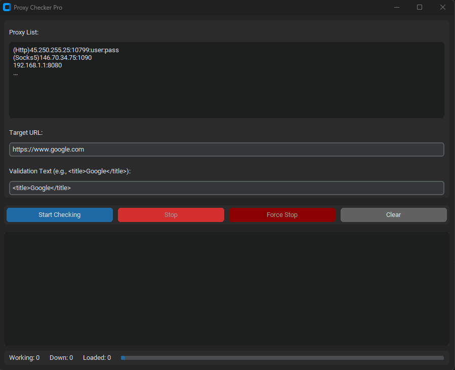

# 🔍 Proxy Checker Pro

A powerful and user-friendly proxy validation tool with both GUI and command-line interfaces. Test HTTP, SOCKS4, and SOCKS5 proxies with real-time results, geolocation detection, and comprehensive reporting.

[](https://python.org)
[](LICENSE)
[](https://github.com/fairy-root)

<div align="center">
  
  <br>
  <em>Main Application Interface</em>
</div>

## ✨ Features

### 🖥️ GUI Application (`app.py`)
- **Modern Dark Theme Interface** - Beautiful customtkinter-based UI
- **Multi-Protocol Support** - HTTP, SOCKS4, and SOCKS5 proxies
- **Flexible Input Formats** - With or without protocol prefixes
- **Real-Time Results** - Live updates as proxies are tested
- **Progress Tracking** - Visual progress bar and counters
- **State Persistence** - Resume checking after interruption
- **Geolocation Detection** - Country information for active proxies
- **Right-Click Context Menu** - Copy, paste, cut, select all
- **Auto-Save Results** - Separate files for working and down proxies
- **Force Stop Option** - Immediate termination when needed
- **Concurrent Processing** - Multi-threaded for fast checking

### 🖥️ Command-Line Tool (`main.py`)
- **Colorized Output** - Beautiful terminal interface with colors
- **Progress Bar** - Real-time progress tracking with tqdm
- **Batch Processing** - Process large proxy lists efficiently
- **Detailed Logging** - Comprehensive error reporting
- **Country Detection** - Geolocation for all proxies
- **File-Based Input** - Read proxies from text files
- **Concurrent Execution** - Configurable thread pool

## 🚀 Installation

### Prerequisites
- Python 3.7 or higher
- pip (Python package installer)

### Install Dependencies

```bash
# Clone the repository
git clone https://github.com/fairy-root/proxy-checker-pro.git
cd proxy-checker-pro

# Install required packages for GUI version
pip install customtkinter requests

# Install additional packages for CLI version
pip install colorama tqdm
```

### Alternative Installation
```bash
# Install all dependencies at once
pip install customtkinter requests colorama tqdm
```

## 📖 Usage

### 🖥️ GUI Application

```bash
python prcheck.py
```

**Features:**
1. **Input Proxies**: Paste or type proxies in the text area
2. **Set Target URL**: Default is Google, can be customized
3. **Validation Text**: Text to verify in response (e.g., page title)
4. **Start Checking**: Begin validation process
5. **Monitor Progress**: Watch real-time results and progress
6. **Stop/Resume**: Pause and resume with state persistence

**Supported Proxy Formats:**
```
(Http)45.250.255.25:10799:user:pass
(Socks5)146.70.34.75:1090
(Sock4)192.168.1.1:8080
192.168.1.100:3128
127.0.0.1:8888:username:password
```

### 🖥️ Command-Line Tool

```bash
python main.py
```

**Setup:**
1. Create a `proxies.txt` file with your proxy list
2. Run the script
3. Results saved to `working.txt` and `down.txt`

**Example `proxies.txt`:**
```
(Http)45.250.255.25:10799:user:pass
(Socks5)146.70.34.75:1090
(Http)192.168.1.1:8080
```

## ⚙️ Configuration

### GUI Application Settings
- **Target URL**: Customize the website to test against
- **Validation Text**: Change the text to look for in responses
- **Thread Count**: Automatically optimized (max 50 threads)
- **Timeouts**: 5 seconds for proxy tests, 2 seconds for geolocation

### CLI Tool Configuration
Edit the constants in `main.py`:
```python
INPUT_FILE = "proxies.txt"          # Input file name
WORKING_FILE = "working.txt"        # Output for working proxies
DOWN_FILE = "down.txt"              # Output for failed proxies
TARGET_URL = "https://www.google.com"  # Test URL
VALIDATION_TEXT = "<title>Google</title>"  # Text to validate
REQUEST_TIMEOUT = 10                # Request timeout in seconds
MAX_WORKERS = 50                    # Number of concurrent threads
```

## 📁 Output Files

### GUI Application
- `working.txt` - List of working proxies
- `down.txt` - List of non-working proxies
- `proxy_state.txt` - Saved state for resuming (auto-managed)

### CLI Tool
- `working.txt` - Working proxies with details
- `down.txt` - Failed proxies with error information

## 🔧 Advanced Features

### State Persistence (GUI Only)
- Automatically saves progress when stopped
- Resume exactly where you left off
- Cleared when checking completes

### Multi-Protocol Support
- **HTTP/HTTPS**: Standard web proxies
- **SOCKS4**: Socket-based proxies (no authentication)
- **SOCKS5**: Advanced socket proxies (with authentication)

### Error Handling
- Connection timeouts
- Proxy authentication failures
- DNS resolution errors
- Network connectivity issues
- Malformed proxy formats

### Performance Optimization
- Concurrent processing with thread pools
- Automatic thread count optimization
- Reduced timeouts for faster results
- Memory-efficient processing

## 🛠️ Troubleshooting

### Common Issues

**"No valid proxies found"**
- Check proxy format matches supported patterns
- Ensure file exists and is readable
- Verify proxy syntax is correct

**"Connection timeouts"**
- Proxies may be down or slow
- Try reducing thread count
- Check internet connectivity

**Threading errors on exit**
- Force stop button available in GUI
- Ctrl+C handling implemented
- Automatic cleanup on exit

### Performance Tips
- Use 10-50 threads for best performance
- Test with a small list first
- Check your internet connection
- Some proxies may be geographically distant

## 🤝 Contributing

1. Fork the repository
2. Create a feature branch (`git checkout -b feature/new-feature`)
3. Commit your changes (`git commit -am 'Add new feature'`)
4. Push to the branch (`git push origin feature/new-feature`)
5. Create a Pull Request

## 📝 License

This project is licensed under the MIT License - see the [LICENSE](LICENSE) file for details.

## Donation

Your support is appreciated:

-   **USDt (TRC20)**: `TGCVbSSJbwL5nyXqMuKY839LJ5q5ygn2uS`
-   **BTC**: `13GS1ixn2uQAmFQkte6qA5p1MQtMXre6MT`
-   **ETH (ERC20)**: `0xdbc7a7dafbb333773a5866ccf7a74da15ee654cc`
-   **LTC**: `Ldb6SDxUMEdYQQfRhSA3zi4dCUtfUdsPou`

## Author

-   **GitHub**: [FairyRoot](https://github.com/fairy-root)
-   **Telegram**: [@FairyRoot](https://t.me/FairyRoot)

## 🙏 Acknowledgments

- Built with [CustomTkinter](https://github.com/TomSchimansky/CustomTkinter) for modern GUI
- Uses [colorama](https://github.com/tartley/colorama) for terminal colors
- Progress tracking with [tqdm](https://github.com/tqdm/tqdm)

## 📊 Statistics

- **Protocols Supported**: 3 (HTTP, SOCKS4, SOCKS5)
- **Input Formats**: Multiple flexible formats
- **Max Concurrent Threads**: 50
- **GUI Framework**: CustomTkinter
- **Python Version**: 3.7+

---

⭐ **Star this repository if you find it helpful!**

For issues, questions, or suggestions, please [open an issue](https://github.com/fairy-root/proxy-checker-pro/issues) on GitHub.
